## 1. Consecutive Substring - Vimeo

    Input : String s = “abcabd”;
    Output: “abcab”, “d” 

    Example: “dxabxad” = “dxabxad”


## 2. Codility [Code](coding/Codility.md) 

- The problem requires implementing a method changeDirectoryString that takes the current directory path and a cd command string, then returns the updated directory path after applying the command. Here’s a solution to tackle the requirements step-by-step: 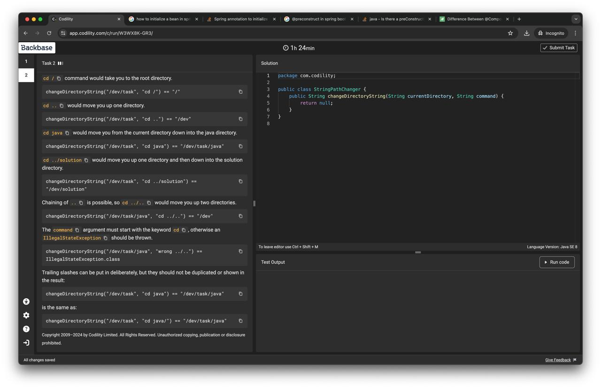 


## 3. Codility [Code](coding/Codility.md) 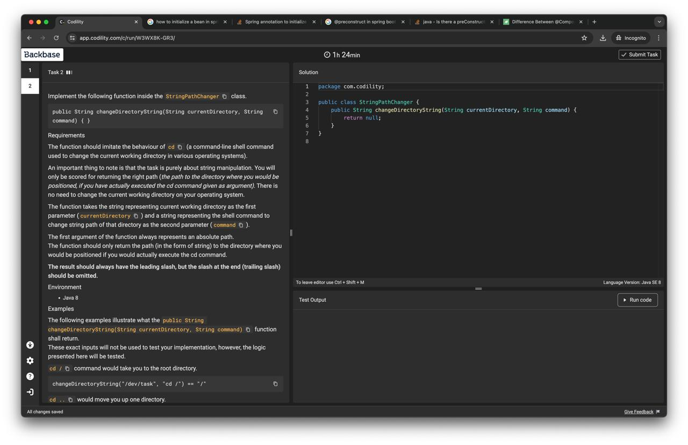

## 4. Codility  

## 5. Codility 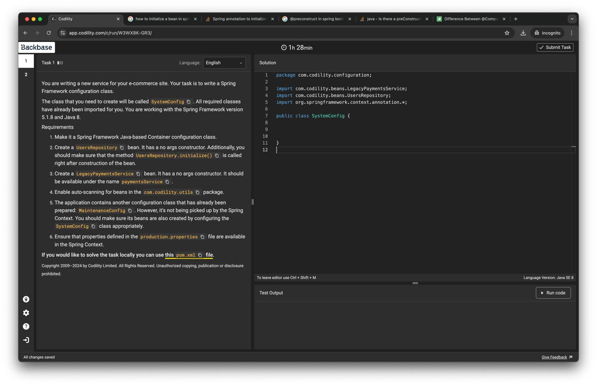

- This new task involves setting up a Spring Framework configuration class (`SystemConfig`) for your e-commerce site. Here's a summary of what is required:

## 6. Athena Health Care [Code](code/athena.md) 

 - You are given an array nums containing n + 1 integers where each integer is in the range [1, n] inclusive. There is exactly one repeated number in the array. Your task is to return this repeated number. 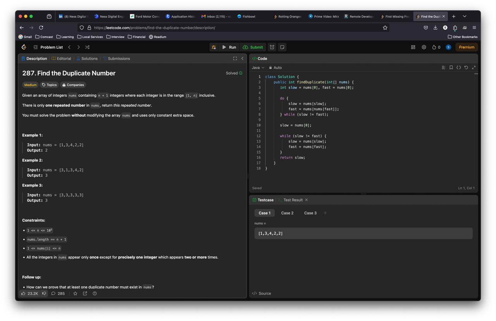 


## 7. Athena Health Care 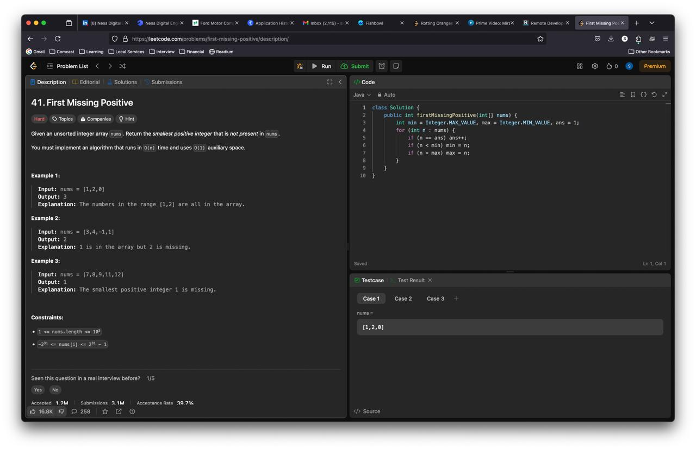 


## 8. Athena Health Care 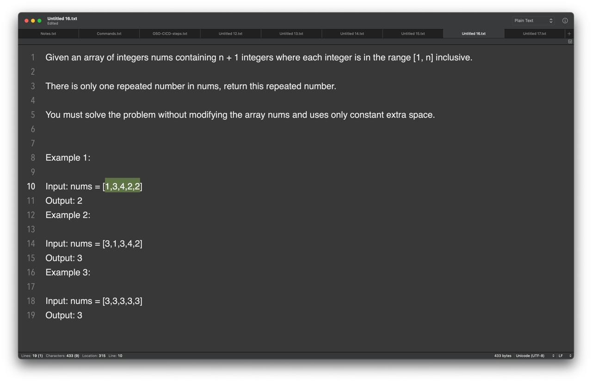 

## 9. Athena Health Care 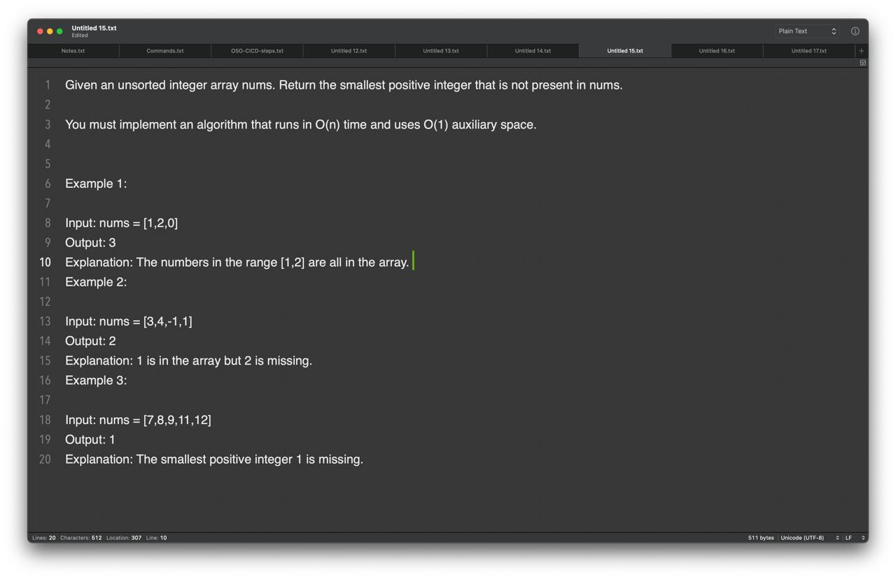

## 10. GoldmanSach 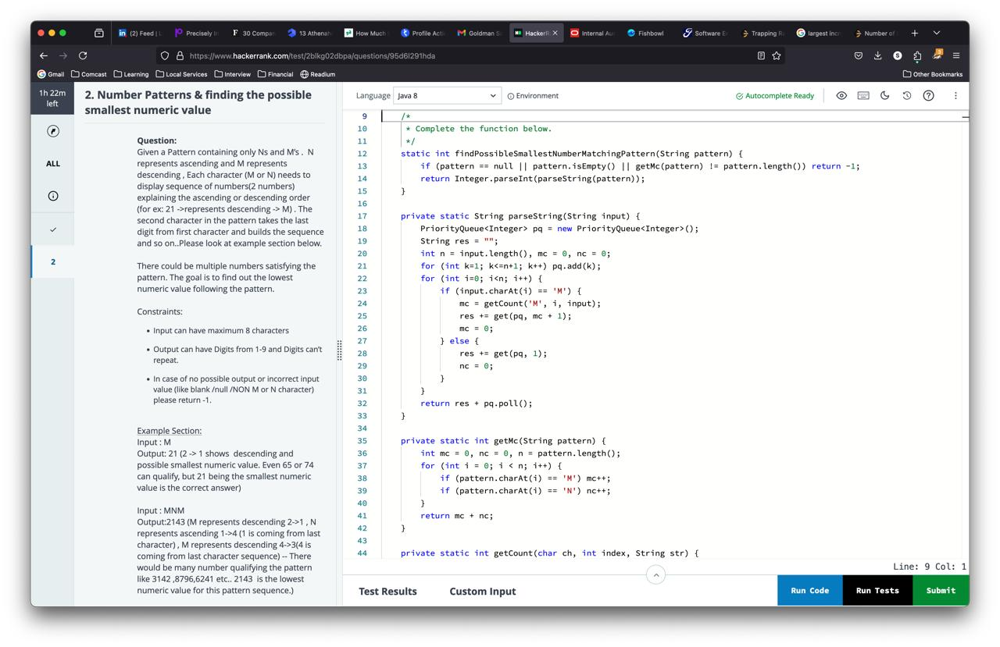 

## 11. GoldmanSach 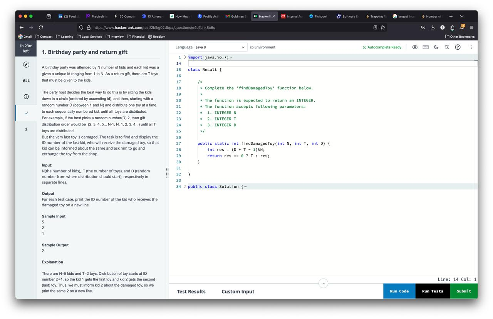

## 12. StarHealth 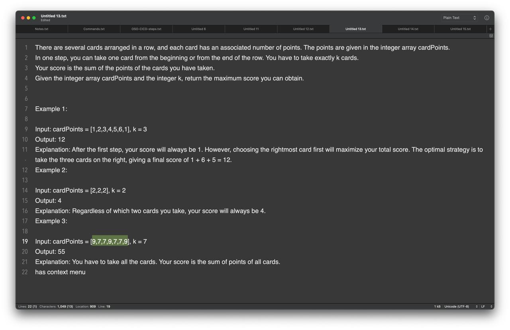 

## 13. StarHealth 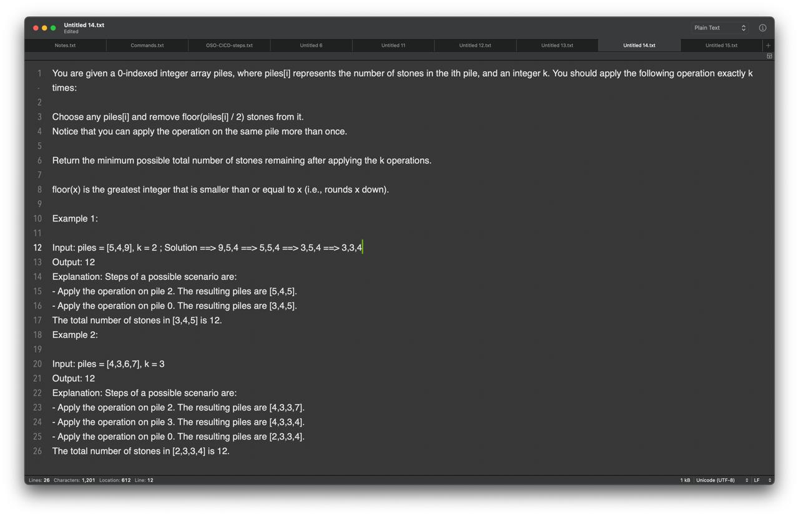 

## 14. Gen Digital - [Code](coding/GenDigital.md)

    - 1. Write Logic for ATM machine  

        // Input: Enter the amt: 2630 

        // Output:  
        // 1000 - 2 
        // 500 - 1 
        // 100 - 1 
        // 20 - 1 
        // 10 - 1 
        // Assume there are infinite number of notes in atm machine

    - 2. String s = “TestABCDE”

        Find max repeating character and min repeating character (both case insensitive). If there are same number of repeating characters:
        For max -> pick the first character alphabetically
        For min -> pick the last character alphabetically

        For this given input T is repeating 2 times, so max is T
        e, s, A, B, C, D, E are all repeating 1 time, so take s as it is the last in alphabetical order

        And then invert max and min

        Output: seTsABCDE


## 15. Avility (full remote) question:

    Koko loves to eat bananas. There are N piles of bananas, the i-th pile has piles[i] bananas. The guards have gone and will come back in H hours.
    Koko can decide her bananas-per-hour eating speed of K. Each hour, she chooses some pile of bananas, and eats K bananas from that pile.
    If the pile has less than K bananas, she eats all of them instead, and won't eat any more bananas during this hour.
    Koko likes to eat slowly but still wants to finish eating all the bananas before the guards come back.
    Return the minimum integer K such that she can eat all the bananas within H hours.

    Input: piles = [30,11,23,4,20], H = 6
    Output: 23

    Input: piles = [3,6,7,11], H = 8
    Output: 4"

    **https://www.geeksforgeeks.org/koko-eating-bananas/**

## 16. Opentext 1st round:
    1. Twosum
    2. Return unique elements in a sorted integer array, without using map [Code](coding/opentext.md#1)

## 17. Opentext round two [Code](coding/opentext.md#2)

    input: {{4, 6}, {6, 5}, {7, 3}, {4, 5}}
    output: {6, 5}

    Given a 2D array, where each index i is a petrol bunk. arr[i][0] is the fuel you can fill from the petrol bulk, and arr[i][1] is the distance to next petrol bunk. 

    Find the first bunk where you have to start so that you can reach the same bunk after covering every bunk (assume first bunk comes after last one in a circular road). Also you start with 0 fuel and assume mileage to be 1 unit of fuel for 1 unit of distance. 


## 18. Tavant:  Implement heap sort in java [Code](coding/tavant.md#1)

## 19. Tavant: Implement binary search on a sorted array

## 20. Tavant: Find longest substring with unique characters in a given string

## 21. stream of numbers 1 to 1000 find the missing numbers [Code](coding/Stream1.md)

## 22. Walmart - Asked merge intervals in first round and then asked to design power-bi reporting system [Code](coding/Walmart.md)

## 24. Rotate Array

## 25. Use generics in you code 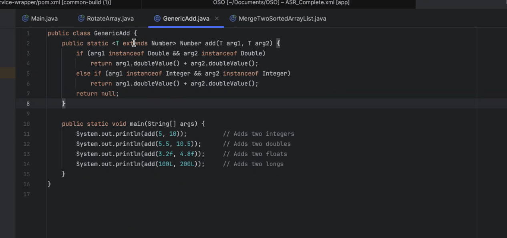

## 26. Caterpillar: This Java program demonstrates how to filter duplicate objects from a list using a Set and Java Streams. The program defines an Order class with fields for orderId, name, product, and location. Two Order objects are considered duplicates if they share the same name, product, and location, regardless of their orderId.[Code](coding/Caterpillar.md)

## 27. Colon format [Code](coding/ColonFormat.md)

## 28. Digit Occurence [Code](coding/DigitCount.md)

## 29. Adjacent Elements Product [Code](coding/AdjacentProduct.md)

## 30. Azentio : This program demonstrates filtering entries from a map based on specific keys (2 to 4) and prints the results. It utilizes Java Streams to process the data. [Code](coding/Azentio.md)

## 31. Anthology :his program finds and prints the maximum value from a list of integers using Java Streams. It utilizes the max method with a comparator to determine the largest number in the list. [Code](coding/Anthology.md)

## 32. Priority Queue [Code](coding/PriorityQueue.md)

## 33. Rotate Array [Code](coding/RotateArray.md)

## 34. Merge Sorted Arrays [Code](coding/MergeSortedArrays.md)

## 35. Move Zeroes [Code](coding/MoveZeroes.md)

## 36. IDFC 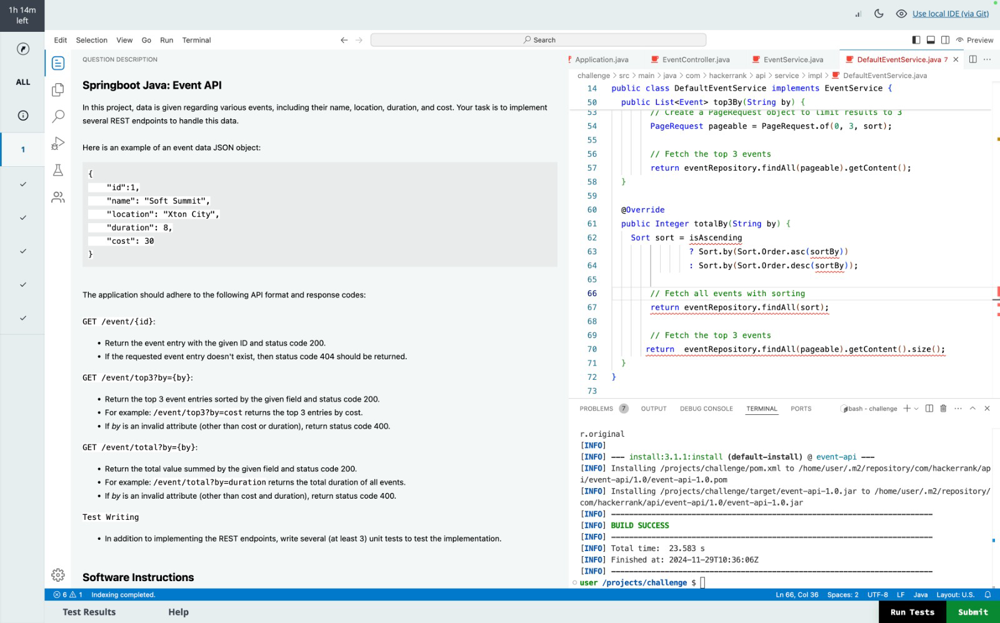

## 37. Shell 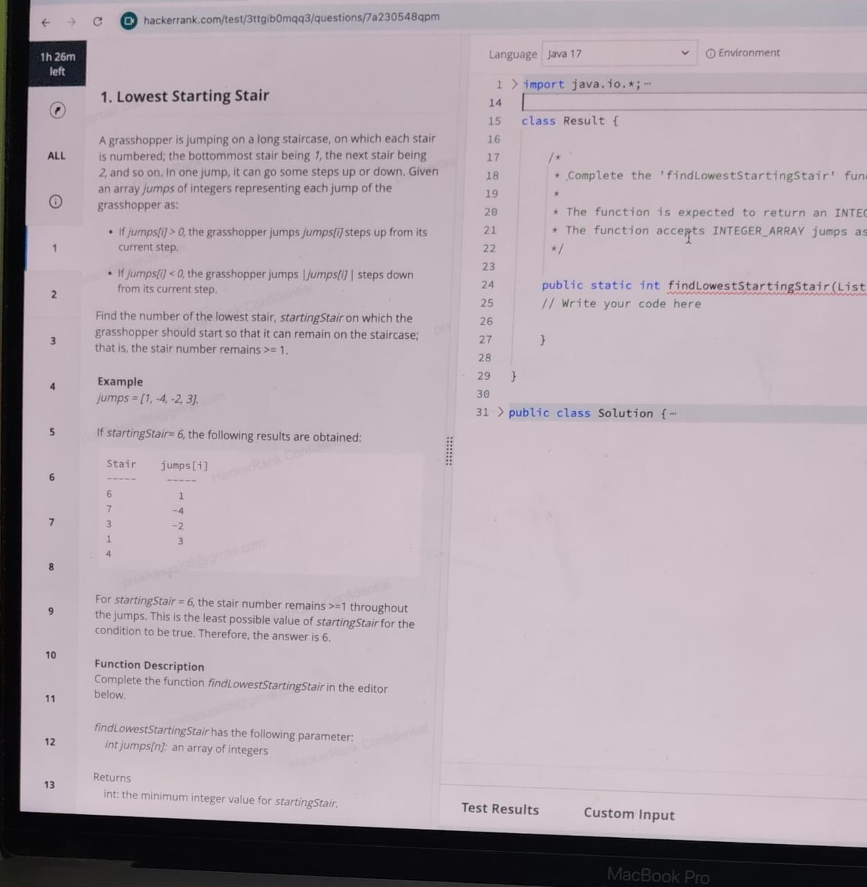

## 38. Athena 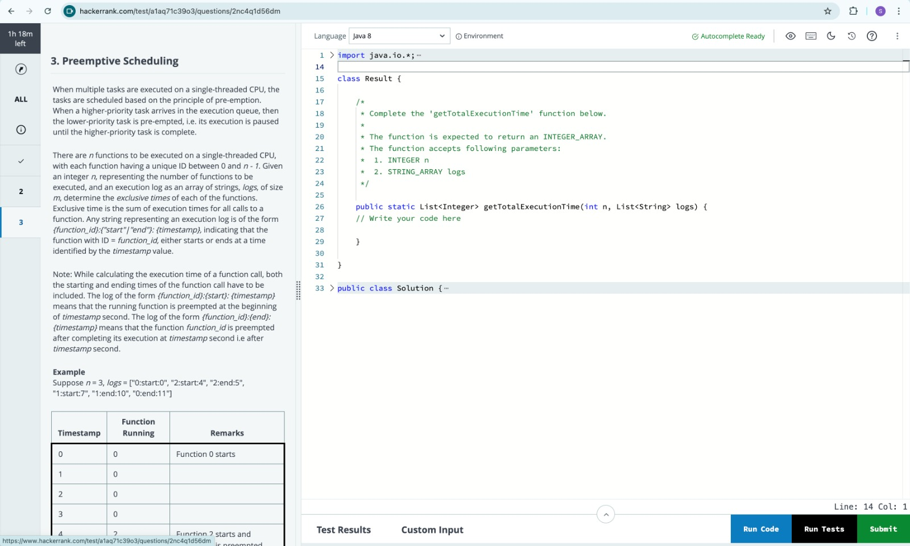

## 39. Athena 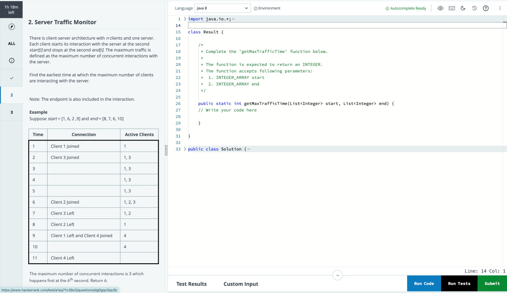

## 40. Athena 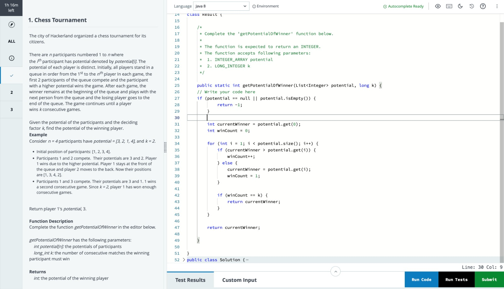

## 41. 

## Stream problems examples  

1. find the sum of squares of all even numbers java 
    ```
    Arrays.stream(input)
    .filter(x->x%2==0)
    .map(x->x*x)
    .forEach(System.out::println)
    ```


2. Find second max of student age java 
    ```
    int age = list.stream
                .mapToInt(student::getAge)
                .skip(1).max();
    ```

3. Find list of unique characters present in all the string java
    ```
    Set<Character> uniqueChars = listOfStrings.stream()
                                .flatMap(str -> str.chars().mapToObj(ch -> (char) ch))
                                .collect(Collectors.toSet());
    ```

4. Group students count by age java
    ```
    list.stream()
    .collect(
        Collectors.groupingBy(Student::getAge, Collectors.counting()));
    ```

5. Convert a list into map  
    java
    ```
    list.stream()
    .collect(
        Collection.toMap(Function.identity(),Function.identity()));
    ```

6. Sort and reverseorder
    java
    ```
    Arrays.stream(arr)
    .boxed()
    .sorted(Comparator.reverseOrder())
    .limit(2)
    ```

7. Get count of each char    
    java 
    ```
    str.chars()
    .boxed()
    .collect(
        Collectors.groupingBy(Function.identity(), Collectors.counting()));
    ```

8. Sort by salary  
    ```
    employeeList.stream().sorted(Comparator.comparingInt(Employee::getSalary))
    ```
9. Find employee with lowest salary
    ```
    employeeList.stream().min(Comparator.comparingInt(Employee::getSalary))
    ```
10. Join given list values with comma
    ```
    Arrays.stream(names).collect(Collectors.joining(","));
    ```
11. Combine array matrix values in a set
    ```
    Arrays.stream(matrixInput).flatMapToInt(Arrays::stream).boxed().collect(Collectors.toList())
    ```