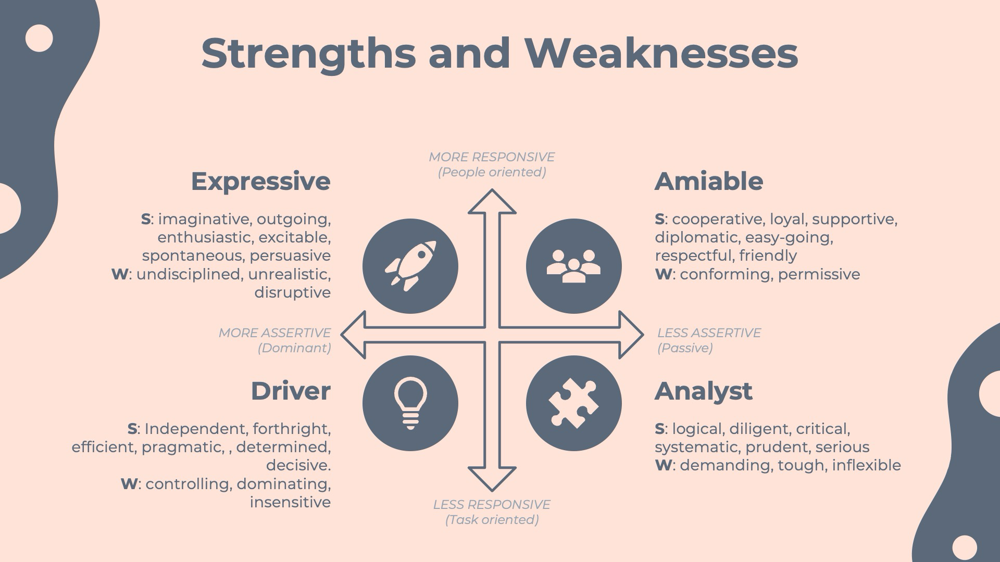

## WorkPlace Communication

### Always make an effort to improve the conversation with other peers.

### Prefer I statements always because YOU statements can be provocative at times.

### Listening is important part of a converstaion. Good listener always gives them more time to understand the issue.

### Verbal queues of listening : Paraphrasing, clarifying, reflecting, linking, summarizing, active silence and open question.

### Non verbal queues: Body language and eye contact

### Posture , Gesture , Eye contact

### body towards --> interested  , Hands crossed might be affected based the views.

### smile can be used as positive reinforcement when we are tense

### hand gestures can be used within the box of head to stomach

### Loud voice can be interpretted as dominant and irritated

### Purpose of the email should be one thing which you require or exepcting them to answer

### Avoid ALL CAPS in email

### No emoji's in email in business

### We can use bullet points

### text size 10-12 , Sans seriff, Use bold , Avoid multiple text colors, Align the text left

### Structure if EMAIL 
- Greetings
- Brief pleasantry when first time - I hope this finds you well
- BLOT -> Bottom Line On Top 
- Clarification part
- Call to Action and timeline make it specific.
- Closing message

### Have Empathy among the peers

### 

### 