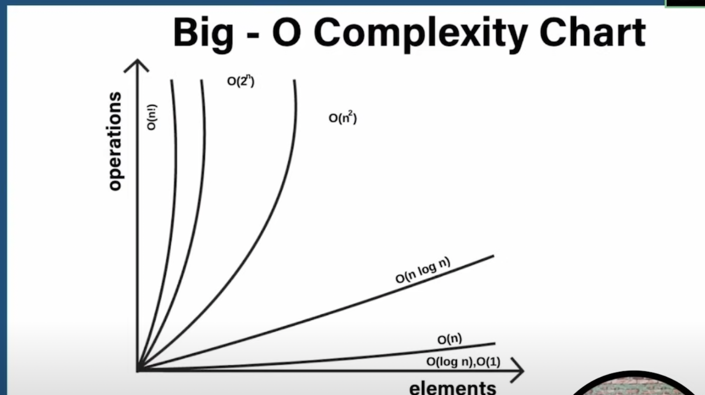
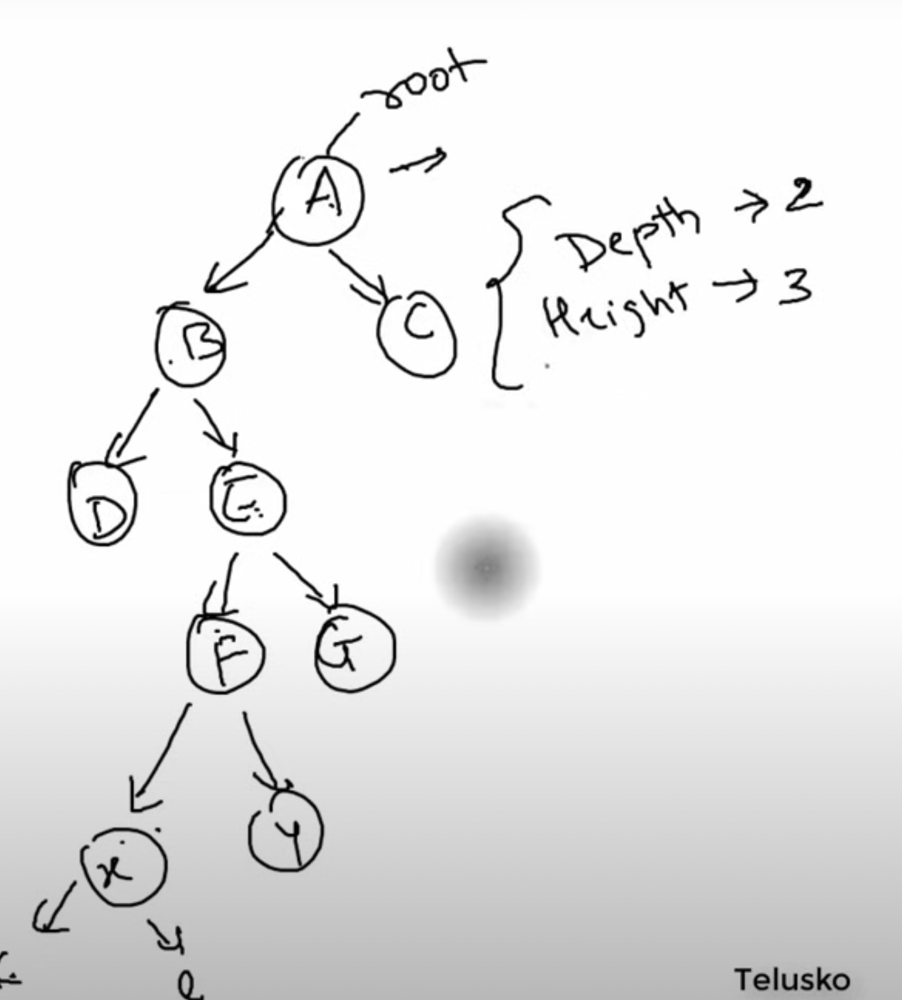

# Data Structure And Algorithm

## Basically a way to organize and store the data faster.

#### https://youtu.be/O9v10jQkm5c?si=WhIzPC2Pq_uq5T55

## ADT: Abstract Data type
- Way of classifying data structures based on how they are used and behaviours they provide.

## Queue - FIFO
- Example: Standing in a queue in restaurant
- enqueue() insert
- dequeue() remove
- add() insert
- poll() delete
- clear()

## Stack - LIFO
- Example: Books are placed on one another
- push()
- pop()
- peek()
- Can be fixed or dynamic
- basic capacity 10*2

## Linear Search
- It is cheking the array one by one if it is the target value or not.
- O(n)

## Binary Search
- Here we calculate the mid value using the Start and End pointer.
- dsa/BasicsDSA.java
- O(Log n)

## Big O Notaion
- O(1): Constant Time
- **O(log n)**: lograthmic time it is **inbetween O(1) and O(n)**
- O(n): linear time
- O(nlog n):linearthmic time
- O(n^2): Quadratic time
- O(n!2): Factorial time
- O(2^n): Exponential time

## Chart 

## Sort

## Bubble Sort
- It is not a efficient way of sorting 
- It has time complexity of O(n)*O(n)
- This just compares the adjacent values two to two until all the possible combinations are checked.
- swap
- 

## Selection sort
- It has time complexity of O(n)*O(n)
- but still the selection algorithm will reduce the iterations by the selecting the maximum or minimum value based on choice
- This will significantly reduces the iterations.
- dedicated inner loop just to find the min or max value
- swap

## Insertion sort
- Shifting will be done here 
- i=1,j=i-1,key
- 17.57.00

## Quick sort 
- its rule is to divide and conquer 
- [1,9,4,5,5] --> [1,9] [4,5,5]
- it will have a pivot value to divide
- i=-1,j=0,pivot=anyelement 
- low , high
- nlog n

## Merge Sort
- divide and conquer
- nlog n
- median is used to divide
- left, right
- 

## Linked List
- 19.28.0

## Queue
- LinkedList:

    Pros: Allows null elements, maintains insertion order, efficient for frequent insertions and deletions from both ends.
    Cons: Higher memory usage due to the doubly-linked list structure.
    Use Case: General-purpose queue, where the insertion order is important, and null elements are acceptable.

- PriorityQueue:

    Pros: Orders elements based on priority, efficient for priority-based processing.
    Cons: Does not maintain insertion order, does not allow null elements.
    Use Case: When elements need to be processed based on priority, like task scheduling.

- ArrayDeque:

    Pros: Efficient for insertions and deletions from both ends, maintains insertion order.
    Cons: Does not allow null elements.
    Use Case: General-purpose deque operations, stack-like and queue-like behavior with efficient performance.

## Tree
### Binary Tree 
- Strict --> each node should have two or none
- full binary tree -->  each node should have two nodes , Leaf nodes should be in the same level
- Complete binary tree --> 
- 

### Binary Search Tree
- higher value in the right node
- lower value in the left node

### Tree Traversal 
- In order traversal
- Pre order 
- Post order