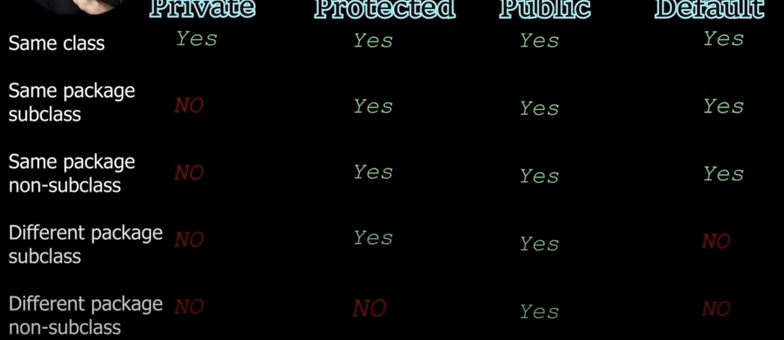

# Java

## Flow of the Java code
- Java code --> Compiler (javac) --> Byte code --> JVM understands bytecode (in OS) 
- JVM will be directed to first class which should have main method(JVM will look for main method).

## Compile and run
- javac filename(Main.java)
- java Main(class name)

## Data Types
- Primitive : Integer (byte- -2^7=128 to +2^7 ,int- 4 bytes, long- 8 bytes), Float(double,float), Character(char-2 bytes), Boolean(boolean)
- 

## Integer
- int a=10_00_000; =1000000 
- binary : int num1= 0b101; =5
- hexa decimal : int num1=0x7E; =126

## Ascii Value
- a:97
- z:122
- A:65
- Z:90

## Casting and Conversion
- Casting: Explicit conversion of a variable int a=(int) 5.6f;
- Conversion: byte to int but int cannot be assigned to byte.

## Assignment Operators and Logical Operator
- *,+,-,/,%
- &&,||,!

## Conditional Statements
- if() else
- else if()
- Ternary operator : int a=10; int result = (a==2) ? 10: 20;
- switch() { case 1:break;}

## Loops
- while()
- for()
- do{} while();

## Object Oriented Programming
- Use Case is the first place were the object orientation starts.
- Objects will be created for doing an action which will be an internal state(behaviour) of the object.
- Every object has an property and behaviour.

## JRE , JVM, JDK
- Java Development Kit : This contains JRE
- Java Runtime Environment : This contains JVM
- Java Virtual Machine : Compiles the Files

## Method Overloading
- same method name but the multiple types of arguments sent to the method.

## Memory 
- JVM consist of stack and heap space to handle the computations of the methods.
- stack stores each methods and variables in key value pair. Each method will have a seaparate stack.
- object creation will happen in heap space.
- stack will have connection with heap to refer the objects.

## Array
- It is collection of elements with static number of elements
- int[] num=new int[3];
- int[] num= {1,2,2};
- Size is fixed.

## Mullti dimensional Array
- int num[][]= new int[2][3];
- Jagged array num[3][] rows are known and columns are unknown , but here the rows should be declared
- jaggedArray()

## String
- Always use ""
- String constant pool consist of all the strings declared in heap space.
- Mutable string(Change) and immutable string (No Change)
- string pool constant exists and string will always create new object it won't modify the constant.

## String Buffer 
- Capacity of String buffer variable is 16.
- append, insert,setlength, ensureCapacity
- Mutable String
- Thread Safe 

## Static keyword
- Static variables are stored in separte place. It can be used by having class name as object.
- Static block will be called only once and it will always be called first.
- if object is not created it will not call static block(use Class.forName(classname) to only intialize a class without create an object)
- We cannot use instance varibles in Static methods.

## Encapsulation
- Intergrating data(variables) and methods into a single entity is called as encapsultaion.

## Getterss and Setters
- Normally when we create a instacne variable in private then it will be accessible only within the class to make it editable and gettable outside the class is were the getters and setters comes in to the picture.

## this keyword
- It represents the current object.
- it will call the constructor of teh same class. **this()**

## Constructor
- Name of the class is constructor name
- Everytime we create a new object we call the constructor by default.
- db connections can be called in the constructor.
- Can be overloaded --> paramaterized constructor
- default constructor is created automatically.

## Super keyword
- Every constructor has the 1 st line as super() to call the parent class default constructor.
- If the parameterized constructor should be called try to use the super(parmeter) which you want to send.
- **Every class in java extends the object class.**

## Naming Convention
- Class, Interface --> Student
- Variable and Methods --> CamelCase
- Constants --> PIE

## Annoymous Object
- new Student().getMarks();
- It has intialization but not a name.

## Inheritance
- extends(is a) keyword is used
- It removes the redundancy in code.
- multi level inheritance is also supported(Calc-->AdvCalc--> ScienCalc).

## Diamond Problem
- Multiple inheritance is not supported in java
- If the same method is in both parent classes it creates a ambiguity problem so multiple inheritance is not supported.

## Method Overriding
- Child class method will override parent class method if the method and its parameters are similar.

## Package
- package keyword is used
- Structuring of the project
- use imports to create objects and use the methods in other packages if its public.
- java.lang package is always imported.

## Polymorphism
- Many behaviours
- Ability of an object to (take many forms) behave differntly based on the input.
- Types: Compile time polymorphism(Early binding)--> Overloading, Run time polymorphism(Late binding) --> Overriding
- A obj=new B(); A -->Obj type is A  B--> Obj implementaion is called a dynamic method dispatch works only with inheritance.

## final keyword
- Once assigned variable it cannot be modified
- final class cannot be inherited
- final method cannot be overridden

## Overriding toString and equals
- We have to override the methods to print and check the exact values of the objects which you are printing and comparing.

