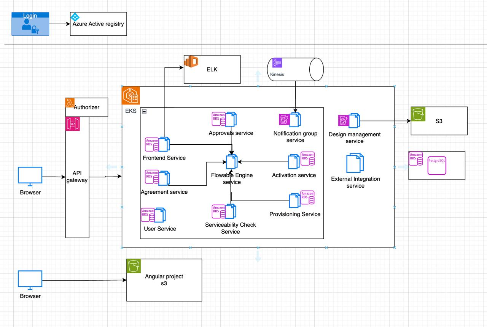

### Questions

- [Questions](Prepping/notes/Questions_Companies.md)

#### Create a custom data structure
```java
public class MyArrayList<E> {
    private Object[] data;
    private int size;
    private static final int INITIAL_CAPACITY = 10;

    public MyArrayList(int initialCapacity) {
        if (initialCapacity < 0) {
            throw new IllegalArgumentException("Initial capacity cannot be negative");
        }
        data = new Object[initialCapacity];
        size = 0;
    }

    public void add(E element) {
        if (size == data.length) {
            // Resize the array
            Object[] newData = new Object[data.length * 2];
            System.arraycopy(data, 0, newData, 0, size);
            data = newData;
        }
        data[size++] = element;
    }

    public E get(int index) {
        if (index < 0 || index >= size) {
            throw new IndexOutOfBoundsException();
        }
        return (E) data[index];
    }

    // Other methods like remove, size, isEmpty, etc. can be implemented similarly
}
```

#### CompletableFuture
- **Async execution of a method**
- CompletableFuture provides more advanced features for asynchronous programming, such as combining multiple asynchronous operations, handling exceptions, and timeouts.
```java
package org.example;

import java.util.concurrent.CompletableFuture;

public class  CompletableFuturePractice{
    public static void main(String[] args) {
        // Start a task to clean the room
        CompletableFuture<Void> cleanRoom = CompletableFuture.runAsync(() -> {
            System.out.println("Cleaning the room...");
            try {
                Thread.sleep(2000); // Simulate time taken to clean the room
            } catch (InterruptedException e) {
                e.printStackTrace();
            }
            System.out.println("Room is clean!");
        });

        // Do other things while the room is being cleaned
        System.out.println("Playing outside...");

        // Wait for the room to be cleaned before doing the next task
        cleanRoom.join();
        System.out.println("Now making a sandwich.");
    }
}
```

#### ArrayList
- **Default capacity:** 10
- **Resizing:** Doubles (2x) when capacity is exceeded

#### HashMap
- **Default capacity:** 16
- **Resizing:** When the number of entries exceeds `0.75 * 16`
- **Load factor:** 0.75
- HashMap is a key-value data structure that stores elements in key-value pairs. It's based on the concept of hashing, which maps keys to hash codes, and then uses these hash codes to determine the bucket where the key-value pair should be stored.
1. Hashing:
- When you insert a key-value pair, the hash code of the key is calculated using a hash function.
2. Bucket Determination:
- The hash code is used to determine the bucket index where the pair will be stored.
- Multiple key-value pairs can be mapped to the same bucket, leading to collisions.
3. Collision Handling:
- Separate Chaining: Each bucket stores a linked list of key-value pairs. When a collision occurs, the new pair is added to the end of the linked list.
- Open Addressing: If a bucket is already occupied, the hash function is used to probe for the next available slot. This can lead to clustering, which can degrade performance.

#### fork join pool
- **Default number of threads:** 1
- **Maximum number of threads:** 1 + (number of available processors - 1)
- completable future

#### Internal working of HashMap

#### Deadlock
- **Definition:** Deadlock can occur when two (or more) threads have a circular dependency on a set of locks.
- **Resolution:** Restart the operation, use `ConcurrentHashMap`, or apply thread locks to methods to ensure data is accessible by one thread at a time.
- **Avoidance:** Use `tryLock()` method, timeouts, and transaction timeouts to prevent indefinite waiting.

#### ACID Properties
- **Atomicity:** Pass or fail with no intermediary states (`@Transactional`).
- **Consistency:** State of the data should always be consistent with business conditions.
- **Isolation:** Errors in a transaction should always be isolated (e.g., locking the thread while updating certain information in the DB).
- **Durability:** Operations should always be committed.

#### SOLID Principles
- **Single Responsibility**
- **Open/Closed Principle**
- **Liskov Substitution Principle**
- **Interface Segregation**
- **Dependency Inversion**

#### Convert a List into a Map via Streams
```java
list.stream().Collectors.toMap(Function.identity(), Function.identity());
```

#### Difference between `@Repository`, `@Service`, and `@Component`
- Annotation	Purpose
- @Component	General-purpose component
- @Service	Business logic layer
- @Repository	Data access layer

#### Garbage Collector in Java
- **Types:** Garbage First (GC), Z Garbage (experimental, used when lower pause time is needed)
- **Function:** Clears out memory frequently

#### Swap Two Numbers Without Temp Variable
- 
```
public static void swapNumbers(int a, int b) {
    a = a + b;
    b = a - b;
    a = a - b;

    System.out.println("After swapping: a = " + a + ", b = " + b);
}
```
- XOR Operation
```
public static void swapNumbers(int a, int b) {
    a = a ^ b;
    b = a ^ b;
    a = a ^ b;

    System.out.println("After swapping: a = " + a + ", b = " + b);
}
```

#### Singleton Pattern

#### Caching in JPA
- **1st Level Cache**
* This is a entry level cache that is maintained by the entitymanager. It is a transactional cache that is cleared after each transaction.
- **2nd Level Cache**
* This secondary cache maintained by EntitymanagerFactory . It is shared or L2 cache which exists until it cleared. Created by using persistance.xml

#### Multithreading
- **Real-time experience in code**

#### Cyclomatic Complexity
- **Definition:** Measures the complexity of a program by considering the conditions available.
- **Formula:** E (edges) - N (nodes) + 2P (connected components)

#### Annotations
- **`@Value("${application.properties}")`**
- **`@RestController`:** Combines `@ResponseBody` and `@Controller`
- **`@ResponseBody`:** Indicates that the return value of a method should be bound to the web response body. When using `@RestController`, it automatically includes `@ResponseBody` for all methods.

#### behaviourial
- **Always have stories** to show somme grit and determination and experience
- Problems faced and stories on how you fixed it
- self motivated
- Think about the questions for them

#### Method Reference
- In Java, a method reference is a shorthand notation of a lambda expression to call a method. It allows you to refer to a method without executing it. The syntax is ClassName::methodName or object::methodName. Method references are a more concise and readable way to write certain types of lambda expressions. They are particularly useful for passing methods as arguments to higher-order functions.

#### Singleton object has prototype instantiation via Autowire so now the prototype will behave as singleton how to change that

- When using Spring Framework, if you have a singleton-scoped bean that has a dependency on a prototype-scoped bean, and the prototype bean is injected via @Autowired, the prototype bean will behave like a singleton. This happens because the singleton bean is created only once and its dependencies (including the prototype-scoped bean) are injected at the time of its creation. Therefore, the same instance of the prototype-scoped bean is used throughout the lifecycle of the singleton bean.To change this behavior and ensure that a new instance of the prototype-scoped bean is created every time it is needed.
- In Application context you can add below code 

``` @Autowired
private ApplicationContext applicationContext;

public void doSomething() {
    PrototypeBean prototypeBean = applicationContext.getBean(PrototypeBean.class);
    prototypeBean.doSomething();
}
```

#### Autowired Scope
- When Manual Object Creation Makes Sense Utility or Stateless Classes:
- If the object has no dependencies and requires no lifecycle management.
- Simple POJOs or DTOs:
- Objects that don't interact with Spring components or features.

#### Cyclic Dependancy
- Cyclic dependencies are a serious issue in Spring Boot applications. The best approach is always to refactor your code to eliminate the cycle. Setter injection and @Lazy are workarounds, but they should be used sparingly and with caution. Always aim for clean, decoupled code.
- Below is the example of cyclic dependency
```java
@Service
public class ServiceA {

    private final ServiceB serviceB;

    public ServiceA(ServiceB serviceB) { // Constructor injection
        this.serviceB = serviceB;
    }

    // ... methods of ServiceA
}

@Service
public class ServiceB {

    private final ServiceA serviceA;

    public ServiceB(ServiceA serviceA) { // Constructor injection
        this.serviceA = serviceA;
    }

    // ... methods of ServiceB
}
```

#### Tavant (Bangalore) Round 2:

3. Why would you need balanced trees like red-black tree and avl tree when you have binary tree with O(log n) search
- While a binary search tree (BST) can theoretically achieve O(log n) search, insert, and delete operations, its actual performance depends heavily on the order of insertions. In the worst-case scenario, a BST can degenerate into a linked list, leading to O(n) time complexity for these operations
- In conclusion, while a standard binary search tree can offer O(log n) performance in ideal scenarios, balanced trees like Red-Black trees and AVL trees provide a more reliable and consistent performance guarantee, making them essential for many applications.

4. Find longest substring with unique characters in a given string
```java
 public static int lengthOfLongestSubstring(String str) {
        int ans=0;
        int i=0,j=0;
        HashSet<Character> set=new HashSet<>();
        while(i<str.length() && j<str.length()){
            if(!set.contains(str.charAt(j))){
                set.add(str.charAt(j++));
                ans=Math.max(ans,j-i);
            }
            else {
                set.remove(str.charAt(i++));
            }
        }
        return ans;

    }
```
5. Spring boot questions (scope and how to handle multithreading)
## Spring Boot: Scope and Multithreading

### Understanding Scopes in Spring Boot

Spring Boot provides several scopes for beans, each with its own lifecycle and management strategy:

1. **Singleton Scope:**
   - **Default scope:** One instance per Spring application context.
   - Suitable for stateless services and configuration beans.
   - Same hashcodes for the objects if the scope is singleton.
   - **Example:** `@Service`, `@Repository`, `@Component` beans.

2. **Prototype Scope:**
   - A new instance is created for each request or dependency injection.
   - Suitable for stateful services or objects that need to be isolated.
   - **Example:** `@Scope("prototype")`

3. **Request Scope:**
   - A new instance is created for each HTTP request.
   - Typically used in web applications.
   - **Example:** `@Scope("request")`

4. **Session Scope:**
   - A new instance is created for each HTTP session.
   - Useful for maintaining state within a user session.
   - **Example:** `@Scope("session")`

**Handling Multithreading in Spring Boot**

Spring Boot offers several mechanisms to handle multithreading and concurrency in your applications:

1. **@Async Annotation:**
   - Marks methods as asynchronous, allowing them to be executed in a separate thread.
   - Requires `@EnableAsync` annotation on the configuration class.
   - **Example:**

   ```java
   @Service
   public class MyService {
       @Async
       public void asyncMethod() {
           // This method will be executed in a separate thread
       }
   }
   ```

2. **@Scheduled Annotation:**
   - Schedules methods to be executed at fixed intervals or specific times.
   - **Example:**

   ```java
   @Scheduled(fixedRate = 5000)
   public void scheduledTask() {
       // This method will be executed every 5 seconds
   }
   ```

3. **Spring's TaskExecutor:**
   - A flexible way to manage asynchronous tasks.
   - Allows you to customize thread pools and task execution strategies.
   - **Example:**

   ```java
   @Autowired
   private TaskExecutor taskExecutor;

   public void executeAsyncTask() {
       taskExecutor.execute(() -> {
           // Task to be executed asynchronously
       });
   }
   ```

**Additional Considerations:**

* **Thread Safety:** Ensure that your shared resources are thread-safe or use synchronization mechanisms like `synchronized` blocks or `Atomic` classes.
* **Concurrency Utilities:** Utilize Java concurrency utilities like `ConcurrentHashMap`, `BlockingQueue`, and `Semaphore` for efficient and thread-safe operations.
* **Testing Asynchronous Code:** Use testing frameworks like Spring TestContext Framework to test asynchronous methods effectively.
* **Error Handling:** Implement proper error handling mechanisms to catch and handle exceptions that may occur in asynchronous tasks.

6. JVM memory management (gc, gc types, heap regions)
- Garbage collection is the process of identifying and reclaiming memory that is no longer in use. The JVM uses different garbage collectors to manage the heap
- Serial collector , Parallel collector , G1 collector, concurrent mark sweep collector
7. Kubernetes (how to debug a pod, how to check logs)
- Kubernetes Logs: Use the kubectl logs command to view the logs of a specific pod:
```
kubectl logs <pod-name> -n <namespace>
```
Use the -f flag to tail the logs in real-time:
```
kubectl logs -f <pod-name> -n <namespace>
```
8. Kubernetes 

* Auto Scaling: 
- Horizontal Pod Autoscaler(new pods) 
- Vertical Pod Autoscaler(increase size of existing pod)

* Configuring Memory: 
- define resource requests and limits in the Pod's container specification

* Ports:  
- Container port: The port that the application within the container is listening on.
- Service port: The port that the Service exposes to access the Pods.
- NodePort (Optional): Exposes the Service on a static port on each Node's IP

9. AWS services which you use and explain them

10. How CI/CD flow works in our application, code to deployment to aws.
- We use AWS EKS - Kubernetes service that simplifies running Kubernetes on AWS.
- It handles the complexity of managing the Kubernetes control plane, allowing you to focus on deploying and managing your applications.
- We interact with the EKS cluster using the kubectl command-line tool or the AWS Management Console.
-  EKS provides automated scaling and self-healing capabilities, making it ideal for applications that require high availability and fault tolerance.   


#### UPS

1. manager round question: if u left the team, what are the things ur team will miss?
2. interface vs abstract class which should we use and when
3. try,catch, finally if we return a value from all three what will happen ? --> Always the value returned in finally will be returned
4. main class has an constructor and child class has a contructor will the child class constructor directly call the main class constructor
   
    No, the child class constructor will not directly call the parent (main) class constructor automatically unless specified. However, in object-oriented programming, when a child class constructor is invoked, the parent class constructor is implicitly or explicitly called first to initialize the parent class before initializing the child class.
    ```
            class Parent {
            Parent() {
                System.out.println("Parent constructor called");
            }
        }

        class Child extends Parent {
            Child() {
                System.out.println("Child constructor called");
            }
        }

        public class Test {
            public static void main(String[] args) {
                Child c = new Child();
            }
        }
    ```
    Output:
    ```
    Parent constructor called
    Child constructor called

    ```
5. return type using overloading --> No java does not support return type overloading
6. sample(String name), sample(Object) --> sample(null) will call objects--> sample("String") will call the string method
7. PagingRepository --> provides pagination to list of all entities vs JPARepository in Spring --> it extends PagingRepository and provides pagination to list of all entities with some xtra methods
8. Try With Resources --> it is used to close the resources automatically

#### Managerial Ques

1. What was the reason for your job change? 
2. When was the last time you faced a conflict in your team and how did you resolve it? 
3. ⁠What kind of people do you prefer not to work with?
4. ⁠What was your biggest challenge and how did you overcome it? 
5. ⁠What has been your biggest achievement thus far?

#### Thought works

1. Explain current project architecture  / 
2. 

#### UST
1. n+1 problem in Hibernate 

- This is a common problem in Hibernate(ORM) where you have a one-to-many relationship between two entities, and you're trying to fetch the related entities in a single query. However, Hibernate will execute a separate query for each related entity.
- This can lead to performance issues and slow down your application.
- Eager Fetch type can be used to fetch the related entities in a single query.
- Data Volume: For large datasets, lazy fetching with batch fetching is often a good choice.
- Query Frequency: For frequently accessed data, eager fetching or second-level cache can improve performance.
- Application Complexity: Complex relationships might require more advanced techniques like join fetching or custom queries.

2. Default fetch type in Hibernate -> Lazy
3. immutable class --> Final class
4. how to convert the class to immutable class -> Variables as private and final class.
5. Exception -> checked(Checked at compile time ex:IOException, Filenotfound) and unchecked exception(found at run time ex:nullpointer)
6. Functional interface, Method reference
7. inbuilt functional interface
8. Stream example
9. comparable and comparator
- Comparable: Gives us the natural ordering of the objects
- Comparator: Gives us the custom ordering of the objects
```java
        Collections.sort(lst);//comparable compare(a,b)
        Collections.sort(lst,Collections.reverseOrder());//comparator a.compareTo(b)
```
10. SOLID, Design pattern --> decorator

#### Shell
1. questions related to accessing an api end point in java,SQL query.Missed to capture those questions

#### Technical Questions
1. Explain how logging works in a distributed microservice architectured application how to debug during that time ?
2. How ELK works in OSO ?
3.  

#### Questions
1. Circular dependency in spring boot
- A circular dependency occurs when two or more beans directly or indirectly depend on each other. This creates a cyclic reference, preventing Spring Boot from resolving the dependencies correctly.   
```java
@Service
public class A {
    @Autowired
    private B b;
}

@Service
public class B {
    @Autowired
    private A a;
}
```
- Fix by using lazy initialization or by using a third bean that can be used by both A and B .
```java
@Service
@Lazy
public class B {
    @Autowired
    private A a;
}
```
- Constructor injection
```java
@Service
public class A {
    private final B b;

    @Autowired
    public A(B b) {
        this.b = b;
    }
}
```

### Removing duplicates
```
class Solution {
    public int removeDuplicates(int[] nums) {
        if (nums.length == 0) return 0;

        int n=1;
        for(int i=1;i<nums.length;i++){
            if(nums[i]!=nums[i-1]) nums[n++]=nums[i];
        }
        return n;
    }
}
```

#### Intro
- I have been working at Comcast since 2022, where I have contributed to two major projects: Acceleration and OSO.
**Acceleration** is an in-house tool designed to speed up the processing time for customer orders across various form types such as MetroE, Carrier, and Active Core. We developed the Acceleration project using four microservices: Centralized MS, FormService, CenturyService, and one for the UI. The tech stack includes Java, Spring Boot, microservice architecture, and SQL. For CI/CD, we utilized Jenkins/GitHub Action/Concourse. The project was completed in one year and is currently managed by the support team.
**OSO (Order Orchestration Service)** was initially developed by Amdocs and is now being acquired and further developed by Comcast. OSO manages the entire workflow of customer orders, providing notifications in BPM notation on the UI. We use the Activity framework (the predecessor of Flowable) for this purpose. The backend development involves technologies like Java, Spring Boot, microservices, SQL, AWS, Docker containerization, and Kubernetes for container orchestration. I am primarily working on five microservices for this project. For code quality measurement, we use SonarQube.
- Developed and maintained securities trading and corporate action processes, ensuring compliance with SWIFT ISO 15022 & 20022 standards.
- Sample messages for each MT564 -corporate action notification tag based format
Sese 23 - securities settlement transaction xml based format.

#### How CI/CD flow works in our application, code to deployment to aws.
- We use AWS EKS (Amazon ELastic Kubernetes Service)- Kubernetes service that simplifies running Kubernetes on AWS.
- It handles the complexity of managing the Kubernetes control plane, allowing you to focus on deploying and managing your applications.
- We interact with the EKS cluster using the kubectl command-line tool or the AWS Management Console.
- EKS provides automated scaling and self-healing capabilities, making it ideal for applications that require high availability and fault tolerance.

#### Steps to deploy the application to AWS EKS
- Write code.
- Create Dockerfile.
- Build Docker image.
- Push image to ECR(ECR stands for Elastic Container Registry(Docker image Storage). It's a fully managed Docker container registry provided by Amazon Web Services (AWS)).
- Create Kubernetes YAML files (Deployment and Service).
- Apply YAML files to EKS using kubectl.
- Verify deployment.   


