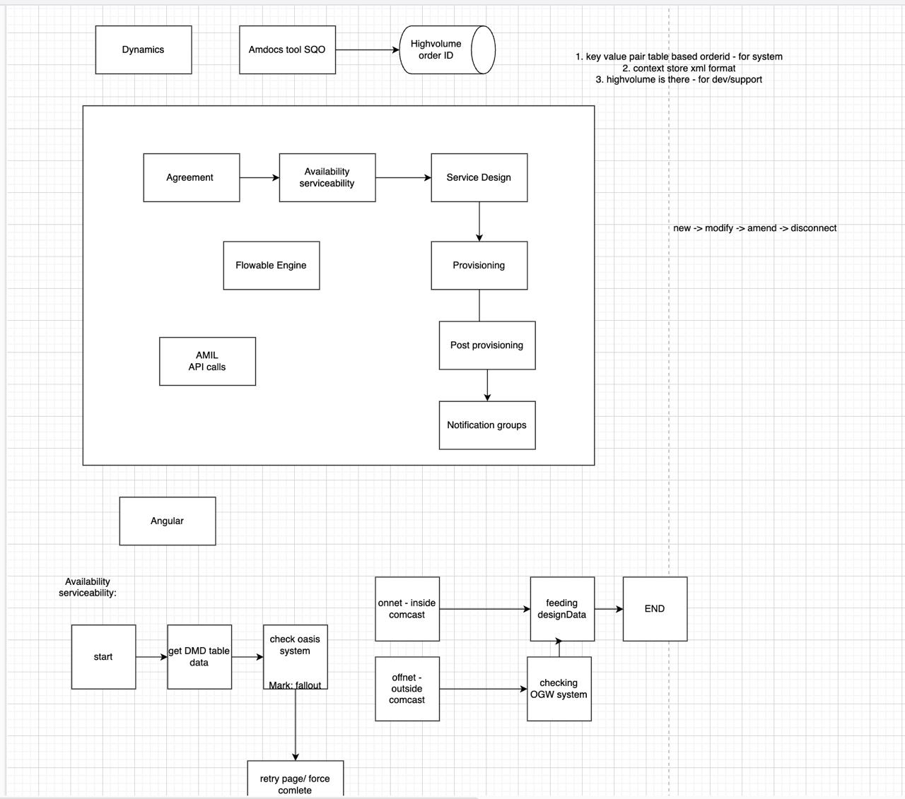

### Questions

#### Create a custom data structure

#### CompletableFuture
- **Async execution of a method**

#### ArrayList
- **Default capacity:** 10
- **Resizing:** Doubles (2x) when capacity is exceeded

#### HashMap
- **Default capacity:** 16
- **Resizing:** When the number of entries exceeds `0.75 * 16`
- **Load factor:** 0.75

#### Internal working of HashMap

#### Deadlock
- **Definition:** Deadlock can occur when two (or more) threads have a circular dependency on a set of locks.
- **Resolution:** Restart the operation, use `ConcurrentHashMap`, or apply thread locks to methods to ensure data is accessible by one thread at a time.
- **Avoidance:** Use `tryLock()` method, timeouts, and transaction timeouts to prevent indefinite waiting.

#### ACID Properties
- **Atomicity:** Pass or fail with no intermediary states (`@Transactional`).
- **Consistency:** State of the data should always be consistent with business conditions.
- **Isolation:** Errors in a transaction should always be isolated (e.g., locking the thread while updating certain information in the DB).
- **Durability:** Operations should always be committed.

#### SOLID Principles
- **Single Responsibility**
- **Open/Closed Principle**
- **Liskov Substitution Principle**
- **Interface Segregation**
- **Dependency Inversion**

#### Convert a List into a Map via Streams
```java
list.stream().toMap(Function.identity(), Function.identity());
```

#### Difference between `@Repository`, `@Service`, and `@Component`

#### Garbage Collector in Java
- **Types:** Garbage First (GC), Z Garbage (experimental, used when lower pause time is needed)
- **Function:** Clears out memory frequently

#### Swap Two Numbers Without Temp Variable

#### Singleton Pattern

#### Caching in JPA
- **1st Level Cache**
- **2nd Level Cache**

#### Multithreading
- **Real-time experience in code**

#### Cyclomatic Complexity
- **Definition:** Measures the complexity of a program by considering the conditions available.
- **Formula:** E (edges) - N (nodes) + 2P (connected components)

#### Annotations
- **`@Value("${application.properties}")`**
- **`@RestController`:** Combines `@ResponseBody` and `@Controller`
- **`@ResponseBody`:** Indicates that the return value of a method should be bound to the web response body. When using `@RestController`, it automatically includes `@ResponseBody` for all methods.

#### behaviourial
- **Always have stories** to show somme grit and determination and experience
- Problems faced and stories on how you fixed it
- self motivated
- Think about the questions for them

#### Method Reference
- In Java, a method reference is a shorthand notation of a lambda expression to call a method. It allows you to refer to a method without executing it. The syntax is ClassName::methodName or object::methodName. Method references are a more concise and readable way to write certain types of lambda expressions. They are particularly useful for passing methods as arguments to higher-order functions.

#### Singleton object has prototype instantiation via Autowire so now the prototype will behave as singleton how to change that
##### When using Spring Framework, if you have a singleton-scoped bean that has a dependency on a prototype-scoped bean, and the prototype bean is injected via @Autowired, the prototype bean will behave like a singleton. This happens because the singleton bean is created only once and its dependencies (including the prototype-scoped bean) are injected at the time of its creation. Therefore, the same instance of the prototype-scoped bean is used throughout the lifecycle of the singleton bean.To change this behavior and ensure that a new instance of the prototype-scoped bean is created every time it is needed.
- In Application context you can add below code 
``` @Autowired
private ApplicationContext applicationContext;

public void doSomething() {
    PrototypeBean prototypeBean = applicationContext.getBean(PrototypeBean.class);
    prototypeBean.doSomething();
}
```

#### Autowired Scope
- When Manual Object Creation Makes Sense Utility or Stateless Classes:
- If the object has no dependencies and requires no lifecycle management.
- Simple POJOs or DTOs:
- Objects that don't interact with Spring components or features.


#### Tavant (Bangalore) Round 2:

3. Why would you need balanced trees like red-black tree and avial tree when you have binary tree with O(log n) search
4. Find longest substring with unique characters in a given string
5. Spring boot questions (scope and how to handle multithreading)
6. JVM memory management (gc, gc types, heap regions)
7. Kubernetes (how to debug a pod, how to check logs)
8. More kubernetes (auto scaling, configuring memory, ports, etc)
9. AWS services which you use and explain them
10. How CI/CD flow works in our application, code to deployment to aws.

#### UPS

1. manager round question: if u left the team, what are the things ur team will miss?
2. interface vs abstract class which should we use and when
3. try,catch, finally if we return a value from all three what will happen ? --> Always the value returned in finally will be returned
4. main class has an constructor and child class has a contructor will the child class constructor directly call the main class constructor
   
    No, the child class constructor will not directly call the parent (main) class constructor automatically unless specified. However, in object-oriented programming, when a child class constructor is invoked, the parent class constructor is implicitly or explicitly called first to initialize the parent class before initializing the child class.
    ```
            class Parent {
            Parent() {
                System.out.println("Parent constructor called");
            }
        }

        class Child extends Parent {
            Child() {
                System.out.println("Child constructor called");
            }
        }

        public class Test {
            public static void main(String[] args) {
                Child c = new Child();
            }
        }
    ```
    Output:
    ```
    Parent constructor called
    Child constructor called

    ```
5. return type using overloading
6. sample(String name), sample(Object) --> sample(null) will call objects--> sample("String") will call the string method
7. PagingRepository vs JPARepository in Spring
8. try with resources

#### Managerial Ques

1. What was the reason for your job change? 
2. When was the last time you faced a conflict in your team and how did you resolve it? 
3. ⁠What kind of people do you prefer not to work with?
4. ⁠What was your biggest challenge and how did you overcome it? 
5. ⁠What has been your biggest achievement thus far?

#### Thought works

1. Explain current project architecture  / 
2. 

#### UST
1. n+1 problem in Hibernate
2. Default fetch type in Hibernate -> Lazy
3. immutable class 
4. how to convert the class to immutable class
5. Exception -> checked(Checked at compile time ex:IOException, Filenotfound) and unchecked exception(found at run time ex:nullpointer)
6. Functional interface, Method reference
7. inbuilt functional interface
8. Stream example
9. comparable and comparator
10. SOLID, Design pattern --> decorator

#### Shell
1. questions related to accessing an api end point in java,SQL query.Missed to capture those questions


