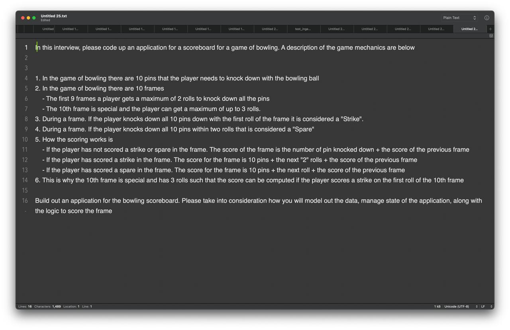
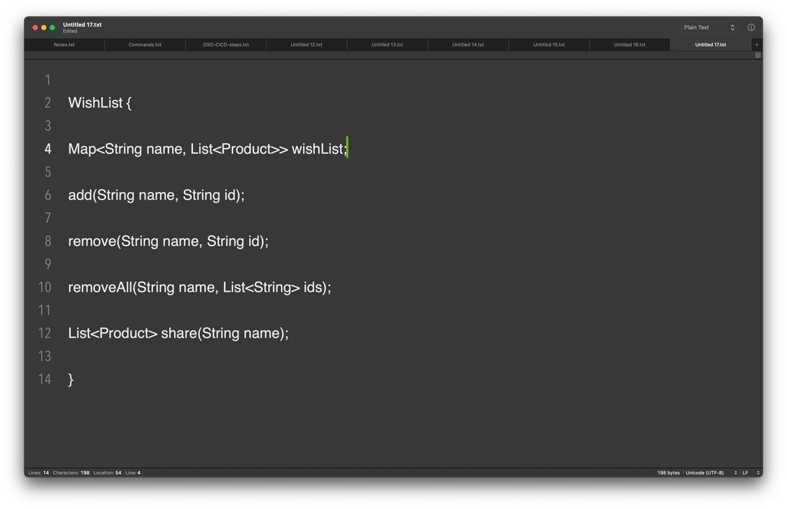

## System Design

### 1. Design a OrderBook (LLD)

Orderbook
Order 3 = User B : SELL | STOCK X | qty 2 units | Rs 100
Order 1 = User A : Buy | STOCK X | qty 4 units | Rs 100 -> ORDER
Order 2 = User X : Buy | STOCK X | qty 2 units | Rs 100
Order 3 = User B : SELL | STOCK Y | qty 1 units | Rs 100
Order 4 = User C : Sell Stock X 4 units Rs 500
 
Order 1 matches Order 3 -> transaction performed
 
Criteria for matching orders:
1 - Sell <= Buy price
2 - FIFO is used to match competing orders (Order 1 matches first before Order 2)

#### Answer - https://leetcode.com/discuss/interview-question/2079858/stock-exchange-lld

### 2 . 

### 3 . 

### 4 . Design a Short URL like bit.ly (Do not use special characters)
- base236 encoding 
- 302 redirecting
- memcached

### 5. Design a restaurants reservation system
- Restaurant table and Customer table , Reservation table.
- Horizontal scaling with load balancer and geo routing 
- NO SQL database(Mongo db due to nedd of high availability ) --> sms notification
- Cached to cutomer data in memcached

### 6. Design a Web Crawler
- entire web or few sites
- need to store every images/html
- Normally web servers are verties on a directed graph
- So basically it is a graph traversal (bfs) all the paths will be covered here
- Queue of URL's to crawl --> PageDownloader(Distributed storage)(content hashes to avoid duplication) -->URL Extraction --> URL Filter --> URL processed

### 7. Design a Top seller systems
- Always try to ask questions up top for the basic desigining of the system then when we get deep into it get some feedback and improvise the system.
- Purchases(Amazon s3) --> Top seller job (Apache spark job) -->  Top server --> distributes cache --> webserver 

### 8. Design a video sharing service(Youtube)
- handling Upload, transcode and view the video
- webservers to return video URL --> Video meta data (NoSQL)
- (CDN) Transcoded Video --> use direct servers of your own servers --> message queues
-  video meta data -->  Raw video --> Transcoding fleet --> Transcoded fleet

### 9. Design a search engine
- how relevant the page is to keywords within it
- What algorithm to use to map keywords to pages and sort them
- what architecture wouldallow you to do all this in the ludicrous scale
- term frequency /document frequnecy in entire web it is not feasible 
- backlinks, terms in doc , their position, Titles, length of documnet, Meta data , 
- web respository --> Indexer -->  index(keept it sorted)
- indexer --> backlinks --> URL normalizer --> links --> page rank algo
- index--> scoring ,ranking,sorting --> inverted index--> front end user 
- Scaling --> DB NOsQL, CLoud , many data cneters with the front end 

